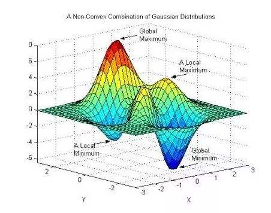

# 🎓 数学建模 宝典秘籍

     
    

&emsp;&emsp;*本文内容主要关于对数学建模相关的介绍与学习，如 **[所需数学相关知识点掌握条例](#welcome)** 、[**所需相关软件学习与程序设计**（涉及 matlab软件 与 python语言）](#welcome) 、 [**必要算法介绍与学习**（matlab软件 或 python语言实现）](#welcome)*

    . 
    . 
    . 

## 【前言：我眼中的数学建模】

&emsp;&emsp;“ 首先如果你看到了这句话，那就请拜托把这部分内容看完吧！（第一段为作者内心独白，第二段开始为正式介绍，若不想听作者废话可直接跳看到第二段开始）我也作为一个学生，或是一个学习者，我很能体会到当一个人要查阅资料，游览网页后点开了某篇文档或教材后迫不及待地去看自己想看的部分，同时也会对其他内容毫不在乎甚至表示有点“碍眼”。诚然，快节奏网络社会发展中，快速知识获取与个人时间成本显得越来越重要，但是我只想和你聊一聊关于我写这篇文章的一点想法，相信你读完后，会对我所有内容有一个大体性的了解。我更希望你能在读我这篇文章时，能与我产生一丝共鸣，能让你在学习与知识获取中感觉到不那么孤单，至少还有人陪着你一起努力。”

&emsp;&emsp;“ 我也是对数学建模初次了解的学生，我写这篇文章时间定格在我大二结束后的暑假里，正值参加全国大学生数学建模比赛培训（校内培训）。稍微说明一下，我的本科专业为计算机科学与技术。我起初对“数学建模”这四个字就并不陌生，但唯有耳闻，不曾一睹。都说百闻不如一见，相信你也是一样，读了网上再多文档（或相关文章），若没亲身体验过，还真不能说自己很了解它。我也希望我能尽微薄之力，能让你换位到我，来和我一起体会和展开对数学建模的认识。”

&emsp;&emsp;*还要特别说明一下，大部分知识点只做框架和原理介绍以及例题讲解，不做详细扩展。毕竟，数学博大精深，每一部分衍生出的知识点是很多的，我们只做对数学建模最重要的、最基础的知识点详述与学习，更多没有但感兴趣的请读者下来自行查资料学习。*

&emsp;&emsp;刚经历了 19 年 9 月 12 日的中秋建模国赛，从 12 日（当周周四）下午 6:00 出题，到 15 日（当周周日）晚上 20:00 陆续各种文件、材料完成提交。本以为我会有很多赛后感悟，诸如吐槽出题方、吐槽题中遇到的各种坑，然而我没有。建模第一天晚上，也就是周四晚上，睡眠时长从凌晨 3 点到次日早上 6 点，第二晚和第三晚均未有系统规模的睡眠。所以我想我也没有精力再去和它吐槽，毕竟已经把我折磨得筋疲力尽。

&emsp;&emsp;针对题目，如果你是非相关专业的学生，很多思想会有专业受限的困扰。你不知道你当前这个想法是否合理，也不知道能否实现，因此，希望大家多和队友交流讨论，并且可以找相关专业的同学、老师请教。对于相关专业问题，网上可查阅到的资料也可供自己好好学习一番。总之，遇到问题不要怕，看得主要是解决问题的能力和决心。我大可这样告诉你，相关专业的同学、甚至老师，也很难把问题给实际的解决掉。毕竟这些问题可是出题方“绞尽脑汁”拿出来折磨我们的啊，哪儿能让你轻易建好模型。并且这些问题大多是现实待（尚未）解决的实际困难，别人同样也研究了这么久，甚至还未能得出一个合理的结论，又怎么可能在 3 天之内，你能得出呢？

&emsp;&emsp;当然，少部分人可以。而如果你觉得你不是那少部分人，或者还没发现自己是那少部分人，那么，对于这种问题，你该怎么去探索以及下笔呢？

&emsp;&emsp;三天的建模肯定不是要你凭空创造一个新的模型，我们主要是对同类型问题模型进行修改，最终变成符合你自己题目的模型。当然这儿也排除那部分很强的人，但我想这种真正意义上的强者也不会看到我的文章了吧。辩驳一下，我觉得一个人的强大无论方面，单方面的强大只能作为其优势。我们接着前面继续，所以这个时候要学会查阅网上论文资料，并且了解一定量的解题模型，这些部分在下面的内容中我都会提及。最后提一句，建模最主要的还是要稳住自己的心态，努力去分析题目，多去找相关资料学习，多找同学、老师交流，希望大家都能有收获吧，坚持一定会有结果的！

    . 
    . 
    .  

+ **以下为整理的知识点集合，单击链接可跳转到相应目录下~**

---

### [1. 数学规划类问题](数学规划类问题)

+ 线性规划

+ 整数规划（包含特殊的 0/1 规划）

+ 非线性规划

> 内容整理于当前路径 [`数学规划类问题`](数学规划类问题) 文件夹下

    . 
    . 
    . 

### [2. matlab 软件解决实际问题](matlab)

+ 安装与简介

+ 基础语法

+ 矩阵（数值）运算

+ 常用算法

> 内容整理于当前路径 [`matlab`](matlab) 文件夹下，涉及关于 matlab 入门与基础教程

    . 
    . 
    . 

### [3. 图论（最短路径）](图论)

> 内容整理于当前路径 [`图论`](图论) 文件夹下

    . 
    . 
    . 

### [4. 插值与拟合]()

> 内容整理于当前路径 [`xxx`](#) 文件夹下

    . 
    . 
    . 

### [5. 微分方程]()

> 内容整理于当前路径 [`xxx`](#) 文件夹下，涉及 matlab 算法对微分方程模型求解

    . 
    . 
    . 

### [6. 数理统计]()

> 内容整理于当前路径 [`xxx`](#) 文件夹下

    . 
    . 
    . 

### [7. 时间序列]()

> 内容整理于当前路径 [`xxx`](#) 文件夹下

    . 
    . 
    . 

### [8. 支持向里机]()

> 内容整理于当前路径 [`xxx`](#) 文件夹下

    . 
    . 
    . 

### [9. 多元分析]()

+ 聚类分析
+ 主成分析
+ 因子分析
+ 判别分析

> 内容整理于当前路径 [`xxx`](#) 文件夹下

    . 
    . 
    . 

### [10. 现代优化算法](现代优化算法)

+ 遗传算法
+ 模拟退火算法
+ 蚁群算法

> 内容整理于当前路径 [`现代优化算法`](#) 文件夹下

    . 
    . 
    . 

### [11. 综合评价](综合评价)

> 内容整理于当前路径 [`综合评价`](#) 文件夹下

    . 
    . 
    . 

### [12. 预测分析]()

> 内容整理于当前路径 [`xxx`](#) 文件夹下

    . 
    . 
    . 

### [13. 数字图形处理]()

> 内容整理于当前路径 [`xxx`](#) 文件夹下

    . 
    . 
    . 

### [14. 论文的写作与规范]()

> 内容整理于当前路径 [`xxx`](#) 文件夹下

    . 
    . 
    . 
    tips:后面没有更多啦~ <a href="#1-数学规划类问题">返回顶部 ⬆</a>

