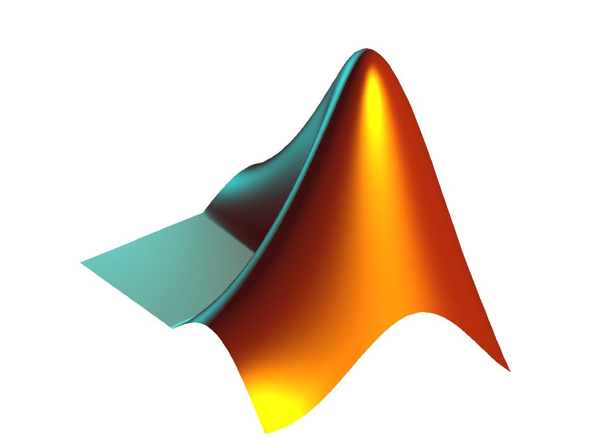

# Matlab 入门教程
> 参考文档[《Matlab基础及其应用教程》](docs/Matlab%E5%9F%BA%E7%A1%80%E5%8F%8A%E5%85%B6%E5%BA%94%E7%94%A8%E6%95%99%E7%A8%8B.pdf)（链接到 pdf 文件下载）

    

## 📚 目录

💡 [**温馨提示：**](#welcome)此文章不完全参考上述文档，下面介绍会尽量体现实用性，不保证完整性，必要知识点还请在文档中查看。

+ [Matlab 发展简介](#w)

+ [Matlab 安装教程](#w)

+ [Matlab 数据类型之矩阵](#w)

+ [Matlab 矩阵（数值）运算](#w)

+ [Matlab 图形与可视化](#w)

+ [Matlab 符号运算（Symbolic）](#w)

## Matlab 发展简介