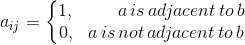
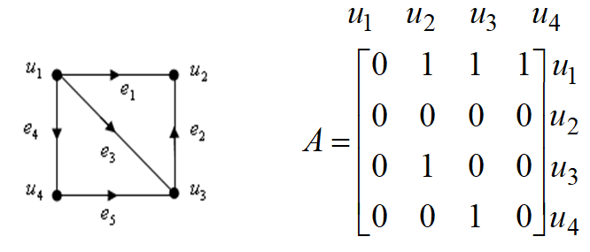
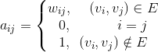
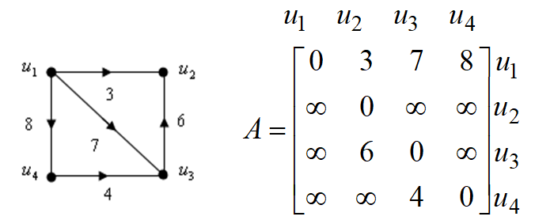
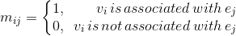
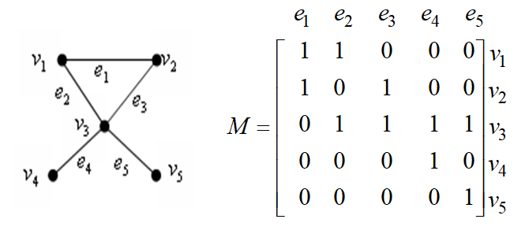
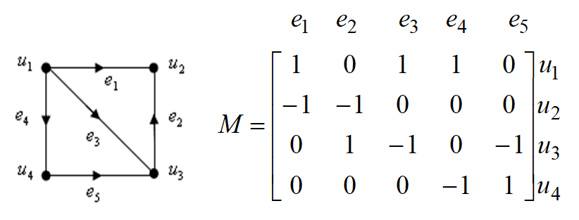

# 🎨 图论

 

&emsp;&emsp;什么是图论问题？让我们从一道题来引入。

&emsp;&emsp;**【例】** 一摆渡人欲将一只狼，一头羊，一篮菜从河西渡过河到河东。由于船小，一次只能带一物过河，并且，狼与羊，羊与菜不能独处，给出渡河方法。（🐺✖🐏，🐏✖🥦</dub>）

 

## 📚 目录

1. **[图的概念](#-基本的数学模型建立)**

1. **[图的矩阵表示](#线性规划)**

    + [邻接矩阵]()

    + [关联矩阵]()

1. **[渡河问题 之例题解答](#整数规划)**

1. **[最短路问题及算法](#非线性规划)**

    + [最短路定义]()

    + [Dijkstra 算法]()

    + [Floyd 算法]()

## 💬 图的概念

### 定义

+ 一个 [图G](#welcome) 是指一个 [二元组 (V(G),E(G))](#welcome) ，其中： 
***1）*** [V(G)={v1,v2,...,vv}](#welcome) 是非空有限集，称为 [顶点集](#welcome) ，其中元素称为图G的顶点。 
***2）*** [E(G)](#welcome) 是顶点集 V(G) 中的无序或有序的元素偶对 (vi,vj) 组成的集合，即称为 [边集](#welcome) ，其中元素称为边。

+ [图G的阶](#welcome) 是指图的顶点数 |V(G)|，用 v 来表示；[图的边的数目](#welcome) |E(G)| 用 ε 来表示。

+ 用 G=(V(G),E(G)) 表示图，简记 G=(V,E)。也用 vivj 来表示边 (vi,vj)。

### 赋权图

+ 若图 G=(V(G),E(G)) 的每一条边 e 都赋以一个实数 w(e)，称 w(e) 为边 e 的 [权](#welcome)，G 连同边上的权称为 [赋权图](#welcome)。

    <a href="#-目录">返回目录 ⬆</a>

## 💬 图的矩阵表示

### 邻接矩阵

> *以下均假设图为简单图*

+ 对 [无向图 G](#welcome)，其邻接矩阵 A=(aij)v×v，其中：

      
     

+ 对 [有向图 G=(V,E)](#welcome)，其邻接矩阵 A=(aij)v×v，其中：

      
     

+ 对 [有向赋权图 G=(V,E)](#welcome)，权为 wij，其邻接矩阵 A=(aij)v×v，其中：

      
     

> 对于 [无向赋权图](#welcome) 的邻接矩阵可类似定义。

### 关联矩阵

+ 对 [无向图 G=(V,E)](#welcome)，其关联矩阵 M=(mij)v×ε，其中：

      
     

+ 对 [有向图 G=(V,E)](#welcome)，其关联矩阵 M=(mij)v×ε，其中：

      
     

    <a href="#-目录">返回目录 ⬆</a>

## 💬 渡河问题 之例题解答

    <a href="#-目录">返回目录 ⬆</a>

## 💬 最短路问题及算法

    <a href="#-目录">返回目录 ⬆</a>

