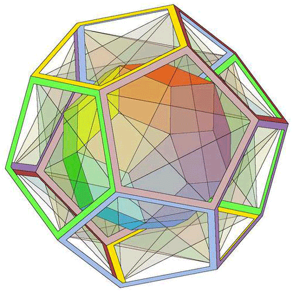
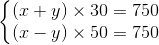

# 📈 数学规划类问题

<div align="center">
    <br>
    
</div>

## 📚 目录

1. [基本的数学模型建立](#-基本的数学模型建立)

1. [线性规划](#线性规划)

1. [非线性规划](#非线性规划)

## ☁ 基本的数学模型建立

&emsp;&emsp;先看一道简单的应用题：

---

💡 **[问：甲乙两地相距 750 千米，船从甲到乙顺水航行需 30 小时，从乙到甲逆水航行需 50 小时，问船的速度是多少？](#quetion)**

&emsp;&emsp;解：用 x 表示船速，y表示水速，列出方程：

<div align="center">
    
</div>

&emsp;&emsp;解得： x=20，y=5

&emsp;&emsp;答：船速每小时20千米。

---

上述 **航行问题** 建立数学模型的基本步骤：

+ 作出[简化假设](#welcome)（船速、水速为常数）；

+ 用[符号表示](#welcome)有关量（x，y表示船速和水速）；

+ 用[物理定律](#welcome)（匀速运动的距离等于速度乘以时间）列出数学式子（二元一次方程）；

+ 求解得到[数学解答](#welcome)（x=20，y=5）；

+ [回答](#welcome)原问题（船速每小时20千米/小时）。

这种看完你会觉得好简单，很正常。其原因在于这是我们从小到大学数学课上都会遇到的普遍应用问题。

但是，我们生活中的实际应用会有那么简单让你建立好你的模型吗?

比如我们来看下一道题：

💡 **[问：椅子能在不平的地面上放稳吗？](#quetion)**

我们来看下我们实际建模中需要的建立过程是怎样：

```
问题分析： 通常，椅子三只脚着地，放稳前提是需要四只脚着地

模型假设： 1.四条腿一样长，椅脚与地面点接触，四脚连线呈正方形；
          2.地面高度连续变化，可视为数学上的连续曲面；
          3.地面相对平坦，使椅子在任意位置至少三只脚同时着地。

模型构成： 用数学语言把椅子位置和四只脚着地的关系表示出来。
          + 椅子位置 
```